# Product Demonstration Report

**Main Window**  
When starting the app, the following window is shown. It includes 4 graphs for quick analysis and a dropdown menu with a button to allow the user to select a specific metric to view the report. Clicking on "Open Report" will open a report window which can be seen below.  
&nbsp;  
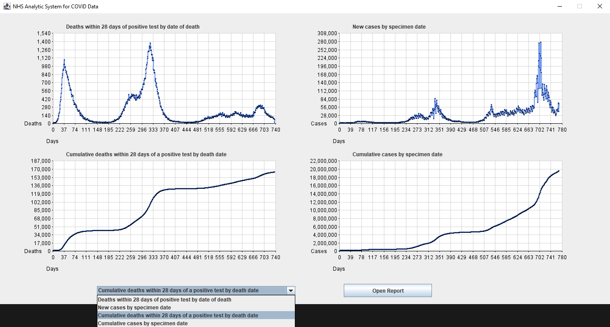  
&nbsp;  
&nbsp;  
**Report Window**  
The display of this window is based on the selected metric from the starting window. It also includes a dropdown that can be used to select a different metric, once clicked the report window will update displaying the graph and text for the new metric, the content of the dropdown is the same as the dropdown menu from the main frame. A clickable hyperlink for the current metric documentation is included in this window.  
&nbsp;  
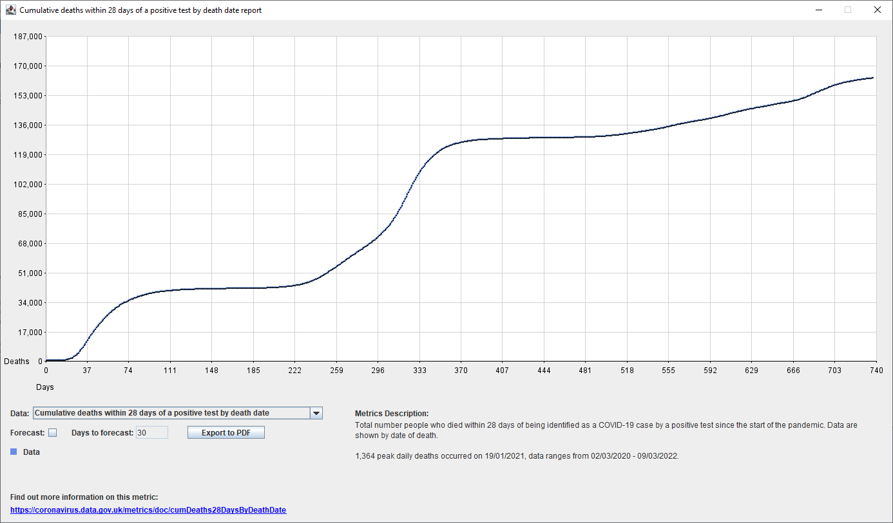  
&nbsp;  
Report window after clicking a different metric:  
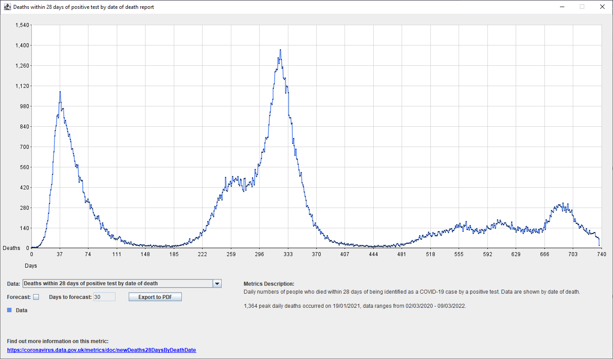  
&nbsp;  
&nbsp;  
**Report Window - forecasting**  
To enable the forecasting on the graph the "Forecast" checkbox needs to be checked, the length of the forecast is derived from the "Days to forecast" text field; it has a default value of 30, disabled if "Forecast" is not checked, only allows number inputs between 0-365 and updates the report window automatically when typing. 2 Extra graph legend entries and the forecast information statistics are shown, they are hidden when the forecast checkbox is not checked.   
&nbsp;  
Two examples of forecasting:  
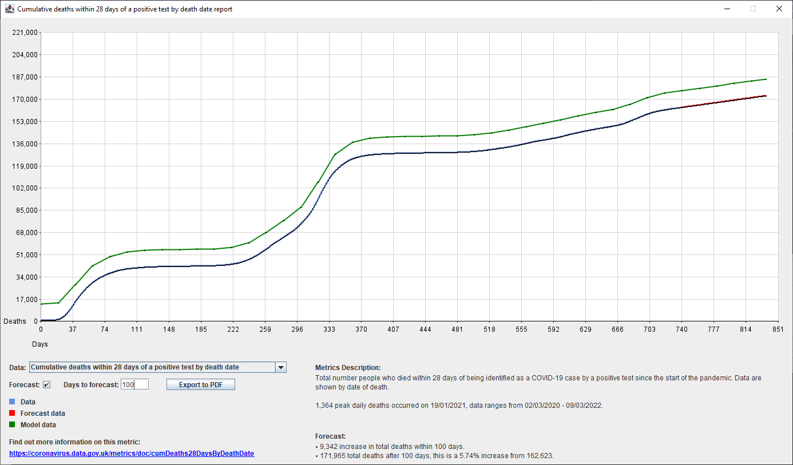  
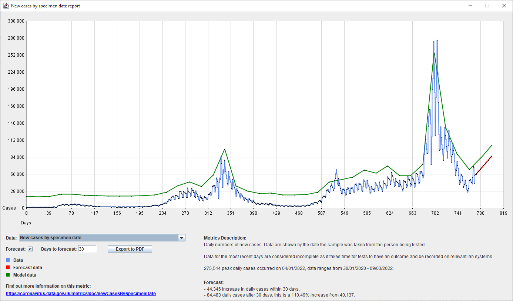  
&nbsp;  
Messages that are displayed when an input above 365 is entered and a negative number input respectively. (Can only reach negative message by pasting in a negative value)  
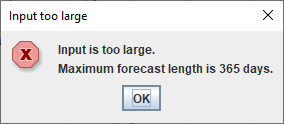  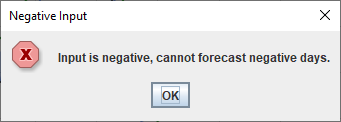  
&nbsp;  
&nbsp;  
**Report Window - negative forecasting**  
If a forecast happens to go below 0 it will stop any further forecasting as it's not possible to have negative deaths/cases, this can be seen below with the days to forecast being 365 and it only forecasting 16 days. If this is the case the exported PDF report will not contain the month and yearly forecast graphs as they would be exactly the same as the below.   
&nbsp;  
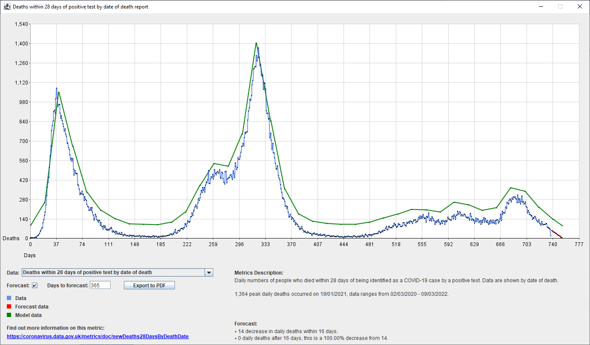 
&nbsp;  
&nbsp;  
**File Chooser**  
This file chooser appears when the "Export to PDF" button is clicked, the user can then browse to a location to save the PDF file and provide a name for the file. A message is displayed if the file has been saved successfully and also if an error has occurred when attempting to create and save the PDF file.  
&nbsp;  
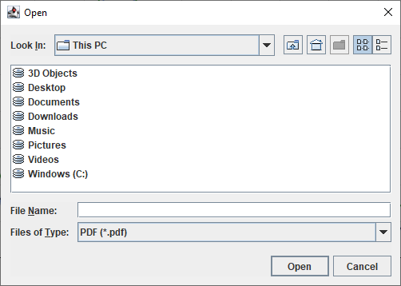  
&nbsp;  
PDF not saved and PDF saved messages respectively:  
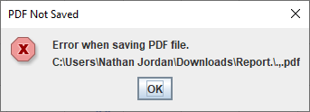
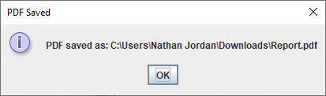  
&nbsp;  
&nbsp;  
**Exporting PDF**  
The following PDF report is generated when the "Export to PDF" is clicked on the below report window. Note, 3 graphs are attempted to be added to the PDF report (30 days, custom forecast days and 365 days), the graphs are shown in ascending order and if the custom forecast is 30 or 365 then that graph is shown respectively instead of the custom forecast.
&nbsp; 
&nbsp;  
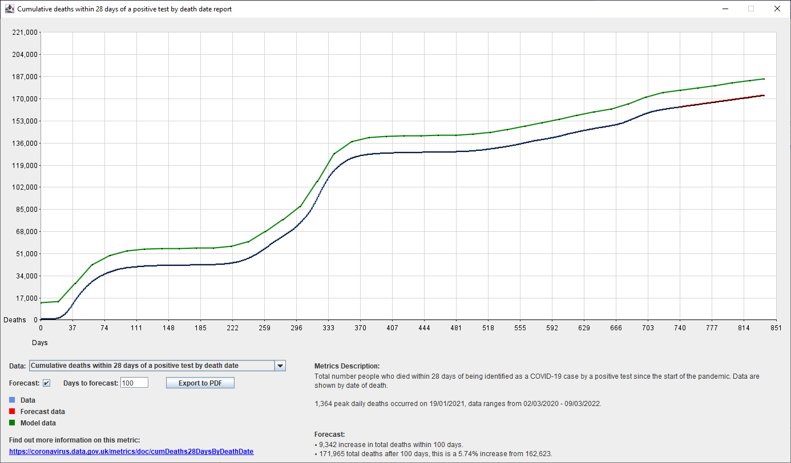  
&nbsp;  
PDF report created from the window above:  
Page 1  
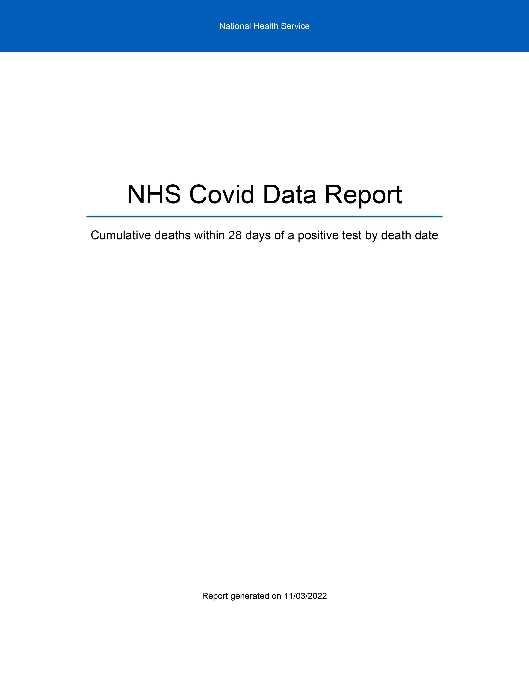  
Page 2  
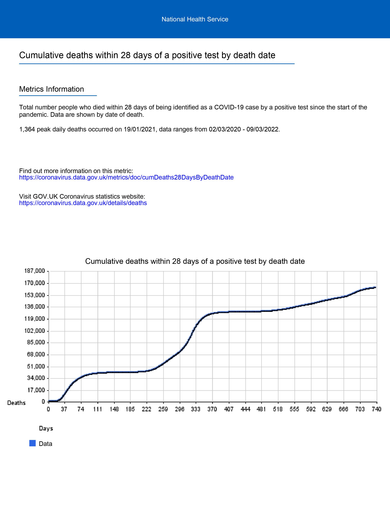  
Page 3  
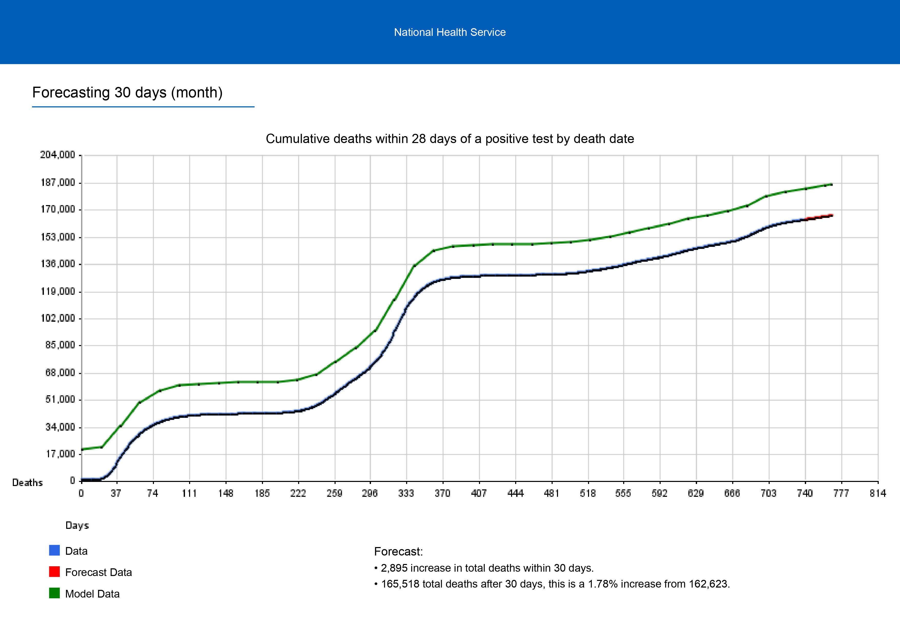  
Page 4  
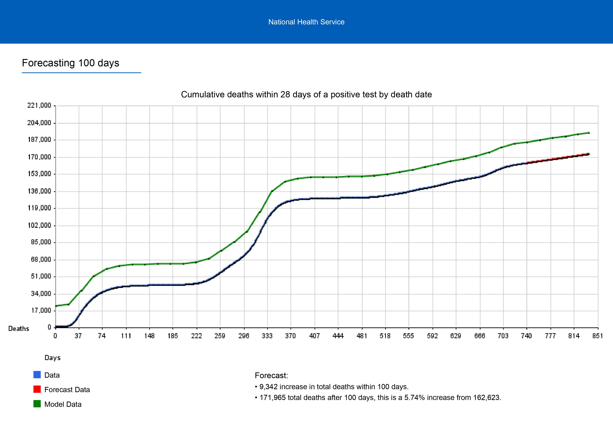  
Page 5  
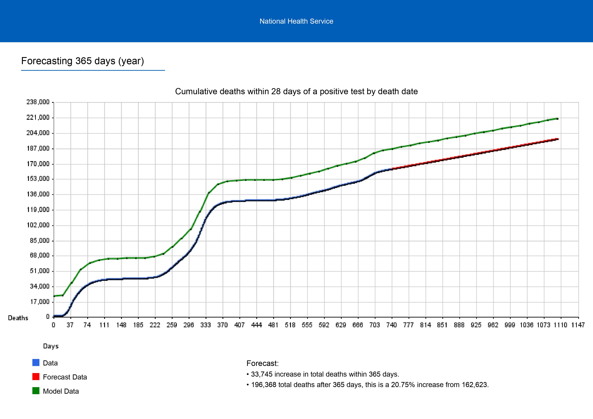  

## Incomplete sections

One aspect we did not get round to is chaning the style of the windows to match a similar theme to NHS, preferably a similar style to the generated PDF report.

If the user does cancels the Export to PDF action it just closes the file chooser, we would prefer it to have some feedback saying the file has not been saved.
