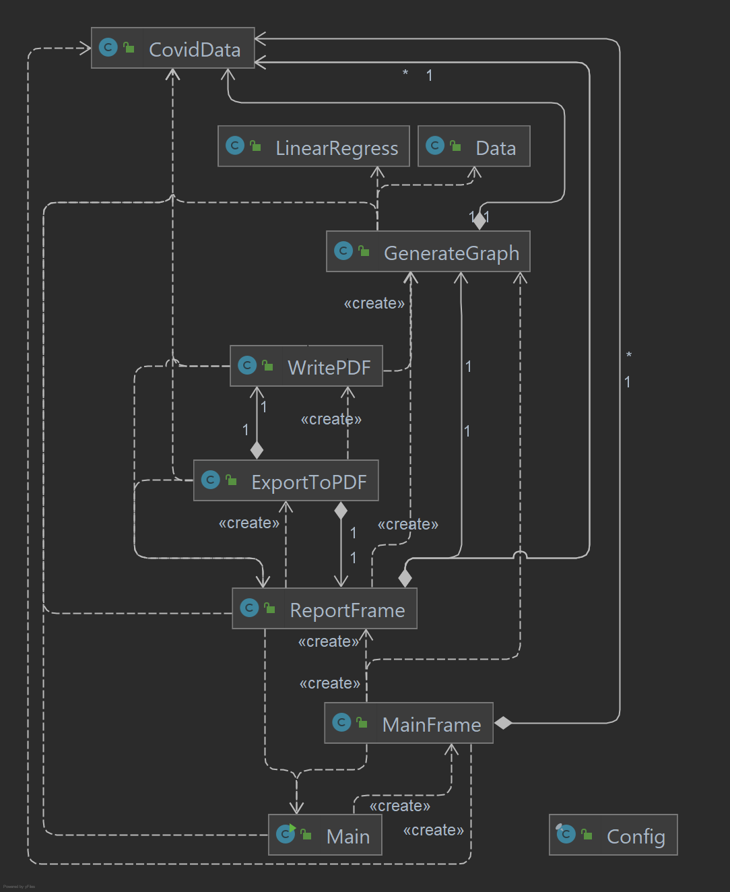
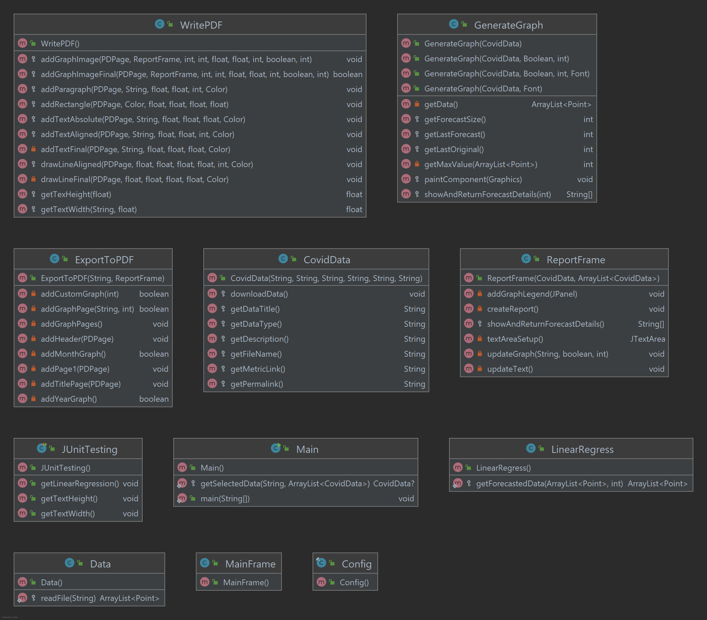
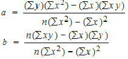

# Team Implementation Report

## Technical Diagrams

**UML Class Diagram**  


**Fields Diagram**  


**Methods and Constructors Diagram**  


## Technical Description

Initially, we had decided on Python as the programming language and we had a very primitive implementation for the MVP, but with further development, we concluded that Java would be the ideal language for the program. Java was selected as the language of choice due to the fact that we as a team felt more on confident in our knowledge of Java compared to Python. As a team we also decided on IntelliJ IDEA as the integrated development environment (IDE) we will use as we are experienced with the software, in addition to that, IntelliJ made working for a team a lot less complicated, it allowed us to see changes each of us had made and make our own individual contributions with overwriting someone else's work.

The code for the graph display was loosely based on a team member's challenge week project, this was then extended with an updated UI and refactored to be dynamic with an overhaul of most of the code. Refactoring and adding dynamic functionality included creating a CSV file (CovidData.csv) that holds data for each metric which is used all throughout the program as the driving data, data can be added to this to extend the range of metrics that can be analyzed. After the GenerateGraph was completed work started on ReportFrame which takes the data from the selected CovidData and produces a graph with forecasting available as required and displays information on the metric/forecast.

### Class Overview
**CovidData:**
Data structure to hold information on each covid metric (permalink of the covid data, data title, metric documentation URL, metric description, filename of the downloaded data, and the type of data of the metric) and a method to download CSV file from the Gov website.

**Main:**
Sets path separator for use on most MAC, Windows and Linux systems, creates MainFrame and contains method to get specific CovidData based on the title.

**MainFrame:**
Creates a list of CovidData objects and calls downloadData() on each. Contains GUI elements with 4 graphs, and the ability to view the report of a specific graph.

**Data:**
Reads and parses the downloaded CSV data into a Point ArrayList, called from GenerateGraph.

**GenerateGraph:**
Generates a graph as a JComponent based on a CovidData parameter, which can be implemented into MainFrame and ReportFrame.

**ReportFrame:**
Opens a new window with an enlarged view of a GenerateGraph based on the CovidData parameter with the ability to choose a different covid metric, forecast a chosen amount of days, and export the report to a PDF file (must choose a location). Includes a link to the metrics documentation, metrics description, forecast information and stats, and a graph legend.

**LinearRegress:**
A static method that uses linear regression to forecast the next n days based on the last 20 data points, returns the data as a Point ArrayList.

**ExportToPDF:**
Contains the content to be added to the PDF and calls the helper methods in WritePDF.

**WritePDF:**
Contains helper methods that add the content into the PDF, the methods include adding text, lines, rectangles, and inserting a GenerateGraph as an image; most of these can be added with alignment, size, and style.

**Config:**
Holds static variables for the program to read from as constants.

**JUnitTesting:**
Contains test code to carry out automatic testing.

**Notible achievements**  
We have not used any 3rd party library for the drawing of the graph, it is all drawn in GenerateGraph, this means it is also easy to resize when exporting the to PDF and it would handle window resizing, however, this is disabled on this program. We are very pleased with the WritePDF class, it will be very easy to use when extending to creating new reports, for example, the below code creates the title page for the report. (Code from ExportToPDF class)
```java
    private void addTitlePage(PDPage page) throws IOException {
        addHeader(page);

        //Center title
        pdf.addTextAligned(page, "NHS Covid Data Report", 30, 200, CENTER, Color.BLACK);
        pdf.drawLineAligned(page, 0, 2f, 250, 100, CENTER, NHS_COLOR);
        pdf.addTextAligned(page, reportFrame.data.getDataTitle(), 14, 260, CENTER, Color.BLACK);

        String todayDate = LocalDate.now().format(DateTimeFormatter.ofPattern("dd/MM/yyyy"));
        pdf.addTextAligned(page, "Report generated on " + todayDate, 10, 680, CENTER, Color.BLACK);
    }
```

**Code Information**
- Programming Language - openjdk-17
- Compiled version - Java 8 (52.0)
- Integrated Development Environment - IntelliJ IDE

## Algorithms and Data Structures

The client, NHS wants the program to be able to predict future COVID-19 cases and death based on the CSV data files chosen, a custom data structure was a necessity to achieve this and also to allow easy reading of the data from to the files which are defined as objects. The main data structures for the program are CovidData to store the information about each metric and a Point ArrayList to store the actual covid data which are manipulated for the forecasting and used when plotting the graph.

When it came to predicting future cases and deaths, we came to the conclusion that the linear regression method would allow us to reach our goal with ease. The linear regression model has two main objectives: 
1. Establish if there is a statistically significant relationship between two variables.
2. Forecast unobserved values by passing x values in and returning predicted y values.

To achieve both objectives, we must determine whether or not there is a relationship between the variables. The linear regression equation is (y’ = a + bx) with x being the unobserved value used to predict the y value this equation is based on the line straight line equation (y = mx + b), where m is the gradient of the line (how steep the line is) and c is the y-intercept (the point in which the line crosses the y-axis). Below is the equation to calculate a and b.  

- Space complexity: Linear regression implementation - O(696 + n * 8) - O(n) without fixed terms.
- Time complexity: Our implementation is fairly static and uses many fixed terms so it is also O(n).

getSelectedData in Main uses an ArrayList of CovidData objects, it has a space and time complexity of O(log(n)).

## Imported Libraries/ Packages

- Java util - Data structures.
- Java awt - User interface implementation, used for layouts and colours.
- Javax swing - GUI, used for all UI windows.
- Java io - Input/output with data streams and file handling.
- Java net - Network implementation, used for downloading data from the Gov website and hyperlinks.
- Java time - Date/time, used to parse strings into dates.
- Java org.apache.pdfbox - 3rd party PDF creation library.

## Known Issues
The graph data is stored in a Point ArrayList, Point storing both an x and y value, however, the x value could be taken away with some refactoring as it is only used to get the x position and is a simple 0 - n range, this could be changed to just use a single value list with the position of the value being used for the x value. This would require making sure the order of the list is correct.

Because the graph data is stored in an ArrayList of Points we can only store integer values, this is only an issue when calculating the linear regression as the calculated values are in double form. Since the numbers in the downloaded data are integers to start with and are fairly large, there would be no noticeable difference. Double values also require twice the storage space in Java.

A solution for this problem would be to alter the code to work with Point2D.Double which allows points to store double values, or if combined with the above issue a single list of doubles could solve both problems. However, the code does work as expected.

When exporting the PDF it will instantly overwrite the existing PDF file without displaying a message that a file has been overwritten or asking if the user wants to overwrite the existing file.

When it comes to adding new metrics to the CovidData.csv file, there are a few issues that arrise, there cannot be any commas in the CSV file as it uses them to split the data, the program does not handle downloaded data that is stored as a decimal (1030.2) and the "Quick Description" cannot have any line breaks in it they must be replaced by a single /NL e.g:  
&nbsp;  
"Line 1/NLLine 2"  
&nbsp;  
and not:  
"Line 1  
Line 2"  
&nbsp;  
or:  
"Line 1  
&nbsp;  
Line 2"
