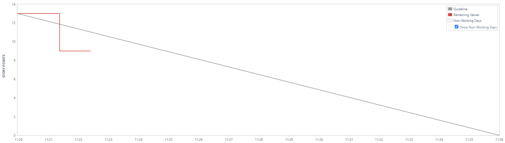
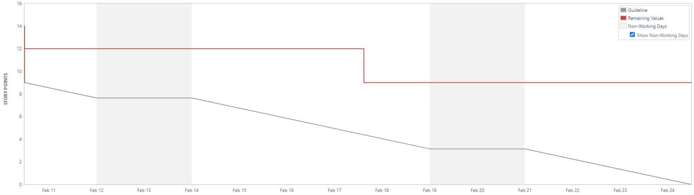
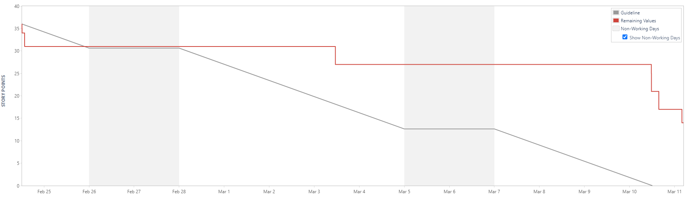
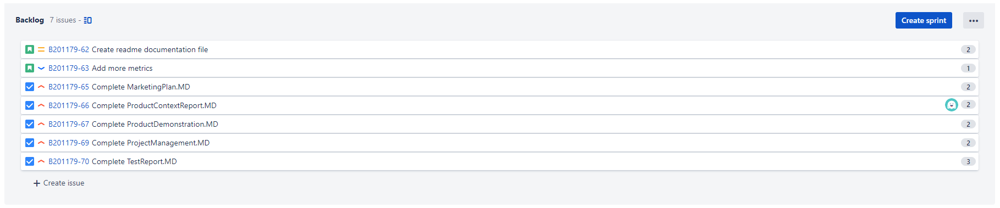
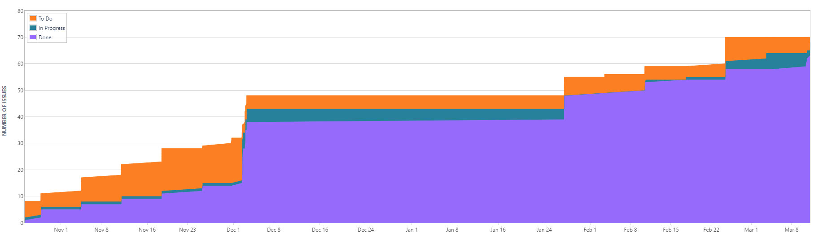
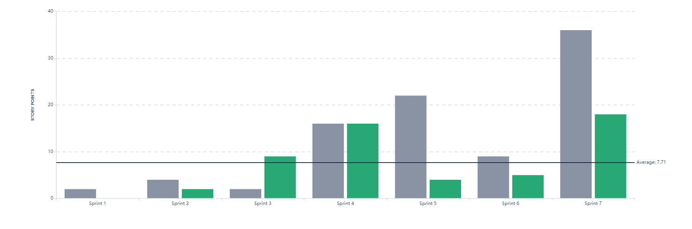

# Project Management Log (Weeks 10-23)

## Project management discussion

The communication between team members during the new term was poor. However, the setup of Discord remained beneficial as much communication of all tam members transpired there.

The scrum remand beneficial meetings allowed the breaking up and organization of tasks; however, there was never an official passing of a Scrum leader for each week contributing to the group's discourse.

## Sprint Burndown Charts
**Sprint 5** - Had some problems with this sprint as it was accidentally completed the same day.

**Sprint 6** - https://cseejira.essex.ac.uk/browse/B201179-53

**Sprint 7**  - Mostly consisting of tasks for completetion of MD files.

## Burndown-Charts Discussion
Each sprint shows that our team completed tasks and logged hours, however, there are considerable gaps of no work towards the middle of the weeks.

Sprint 5 - error as explain above

Sprint 6 - The burndown chart shows no correlation between the remaining value and guideline, stating that the group members did not complete the sprints within the allotted or estimated time. 

Sprint 7 - The burndown chart shows more correlation and even the formation a negative regression line.This signifies that tasks were being completed within the allotted time. However, plenty of tasks while were completed were not completed  within the estimated periods

## Product Backlog

## Other Areas
**Cumulative Flow Diagram**  

**Velocity Chart**  

