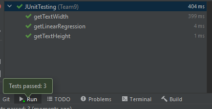

# Test report  

## Testing performed

### Test Plan

This test plan is aimed for testing the program at a user level with each test being an interaction between the user and the program, these tests were run on the complied version of the product. It checks for normal usage of the software.

Some of these tests can be seen in the product demonstration document for example switching of the metrics in report window. All the messages and errors can also be found in the product demonstration.  

Part 1:  
  
Part 2:  
  


## Automatic Testing:
We created 3 JUnit tests, most of our methods are restricted as much as possible with private access modifiers for helper methods so we could not justify implementing more tests, the rest of our product (the majority) have all been tested with unit testing.

To make sure that changes to our linear regression did not cause unexpected results we implemented a JUnit test to pass into the linear regression method, a dataset which we had already known the result, then the test compares both results to assess if they are equal. This is useful as it allows us to re-test the method after making changes to make sure it is still working as intended.

The other 2 JUnit tests are for the helper methods get text width/height which are used for help with positioning when it comes to adding text into the PDF.

These tests have all passed continuously: (Test code found below)  
  
&nbsp;  
&nbsp;  
**Linear regression test:**  
```java
    @Test
    public void getLinearRegression() {
        //Test to ensure linear regression calculation is working
        ArrayList<Point> inputData = new ArrayList<>();
        ArrayList<Point> expectedOutput = new ArrayList<>();
        ArrayList<Point> actualOutput;

        inputData.add(new Point(749, 18628329));
        inputData.add(new Point(750, 18661296));
        inputData.add(new Point(751, 18695709));
        inputData.add(new Point(752, 18733105));
        inputData.add(new Point(753, 18777947));
        inputData.add(new Point(754, 18816692));
        inputData.add(new Point(755, 18852714));
        inputData.add(new Point(756, 18882943));
        inputData.add(new Point(757, 18910497));
        inputData.add(new Point(758, 18935313));
        inputData.add(new Point(759, 18966400));
        inputData.add(new Point(760, 19010668));
        inputData.add(new Point(761, 19054952));
        inputData.add(new Point(762, 19100647));
        inputData.add(new Point(763, 19143892));
        inputData.add(new Point(764, 19184875));
        inputData.add(new Point(765, 19223094));
        inputData.add(new Point(766, 19271183));
        inputData.add(new Point(767, 19335107));
        inputData.add(new Point(768, 19373884));

        expectedOutput.add(new Point(20, 19380360));
        expectedOutput.add(new Point(21, 19418684));
        expectedOutput.add(new Point(22, 19457008));
        expectedOutput.add(new Point(23, 19495331));
        expectedOutput.add(new Point(24, 19533655));
        expectedOutput.add(new Point(25, 19571979));
        expectedOutput.add(new Point(26, 19610302));
        expectedOutput.add(new Point(27, 19648626));
        expectedOutput.add(new Point(28, 19686950));
        expectedOutput.add(new Point(29, 19725273));
        expectedOutput.add(new Point(30, 19763597));
        expectedOutput.add(new Point(31, 19801921));
        expectedOutput.add(new Point(32, 19840244));
        expectedOutput.add(new Point(33, 19878568));
        expectedOutput.add(new Point(34, 19916892));
        expectedOutput.add(new Point(35, 19955215));
        expectedOutput.add(new Point(36, 19993539));
        expectedOutput.add(new Point(37, 20031863));
        expectedOutput.add(new Point(38, 20070186));
        expectedOutput.add(new Point(39, 20108510));

        actualOutput = LinearRegress.getForecastedData(inputData, 20);
        assertEquals(expectedOutput,actualOutput);
    }
```
**Get text height test:**  
```java
    @Test
    public void getTextHeight() {
        WritePDF writePDF = new WritePDF();
        writePDF.font = PDType1Font.HELVETICA;
        float textHeight = writePDF.getTexHeight(12);

        assertEquals(textHeight, 13.872f,0.0f);
    }
```
**Get text width test:**  
```java
    @Test
    public void getTextWidth() {
        WritePDF writePDF = new WritePDF();
        writePDF.font = PDType1Font.HELVETICA;
        float textHeight = 0;

        try{
            textHeight = writePDF.getTextWidth("Test String", 12);
        } catch (Exception e){
            System.out.println(e);
        }

        assertEquals(textHeight, 58.02f,0.0f);
    }
```
