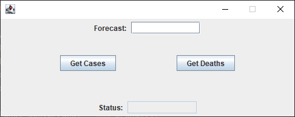
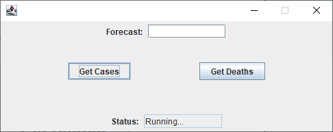
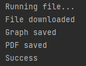
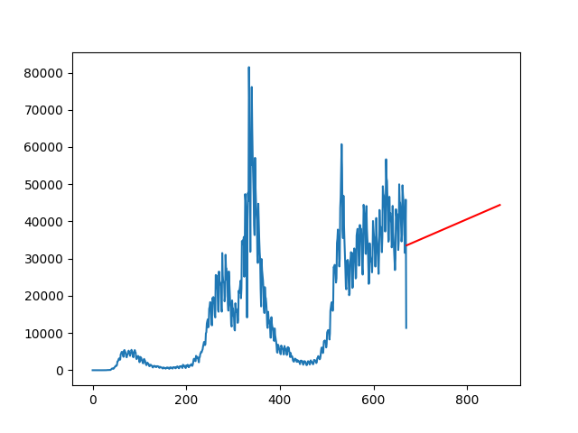
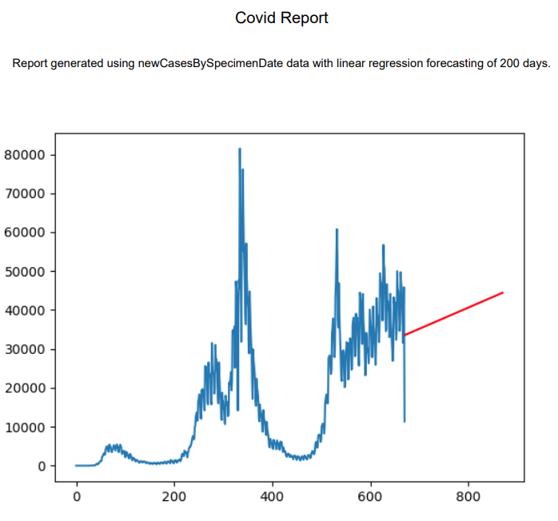

# Product Demonstration Report

## Product MVP Demonstration
Our product is built with a combination of Python and Java, Python for the back-end and Java for the front-end GUI.

The process of the product is as follows:

On starting the app, the following window is shown:

Since there is no logic in the product at the moment either button press will action the same code, this will be updated to work with the text box as an input and the buttons analysing the correct government data (e.g Deaths/cases).

Window when either button is pressed:

When the buttons are clicked, the Python script (DataPull.py) is run and the status text box is updated with "Running...".

Once the Python script has been executed and has terminated the outputs from the script are read and displayed in the Java terminal window, this can be seen below:

Upon successful execution of the Python script the status on the window is updated with "Success":

The Python script draws the graph with the forecasted data (red part of the graph is the forecasted section):

Y axis is cases.

X axis is days (dates converted to numbers signifying days).

The script creates the PDF report inserting hard-coded information and the graph.:

## Incomplete sections

As stated previously, the buttons do have functionality, however, they both do the same thing. Another section that is not complete is the "Forecast" text box, this is supposed to be the input for how long into the future to forecast, the button clicks will take that value as to make the tool dynamic. 

The forecasting end result is very linear, we hope to improve on the model to create a more accurate model.

The data is pulled from the government website with a fixed perma-link so the data is always from the same link. This is just to show functionality and we will incorporate more dynamic features as development continues.

The graph is also not fully completed in the sense of titles and general graph etiquette.
