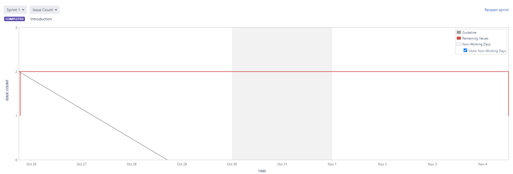
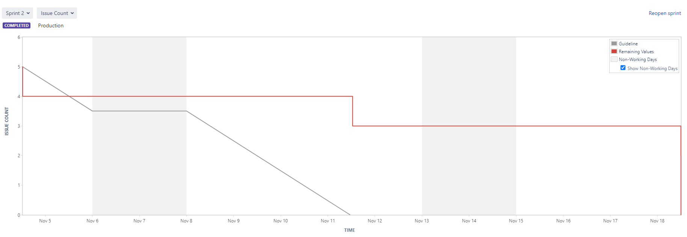
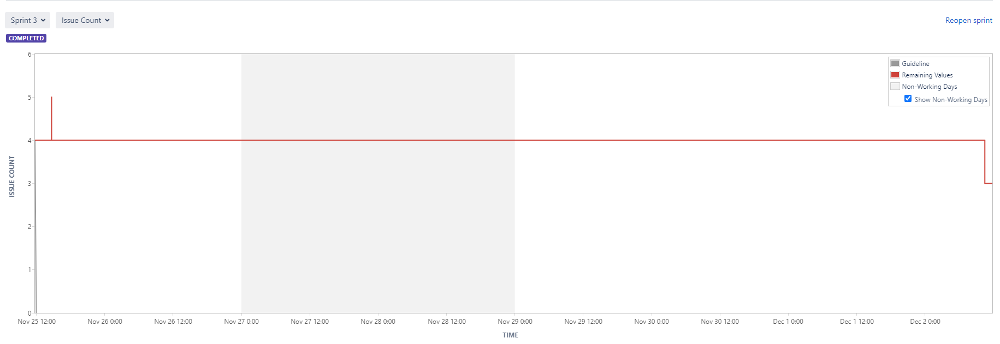
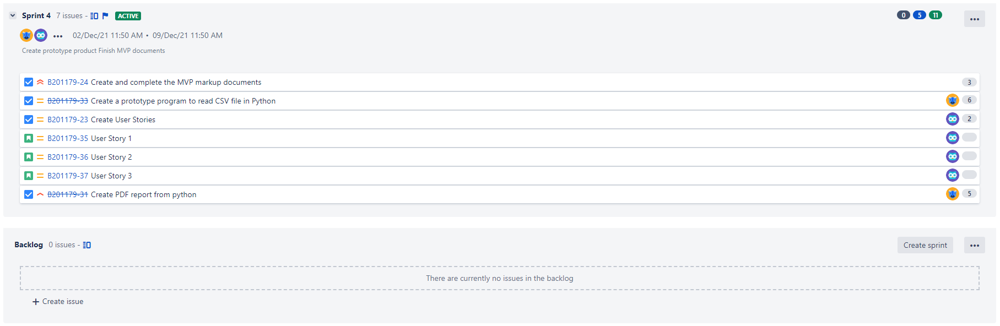
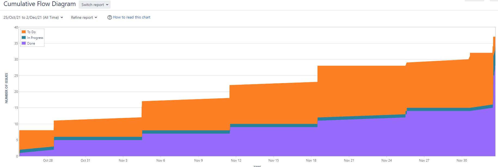

# Project Management Log

## Project Management Discussion

Initially, it was difficult to get in contact with all team members as some were not in the country at the start of the term, we resolved this by getting in contact by emails which then led to a Discord group that allowed us to be in regular contact with eath other. Once the connections were made, working together as group became easy and fluid. The use of Discord allowed to host regular meetings discussing the project and delegating tasks amongst each other.

The scrum meetings were very beneficial for the progress of the project, these meetings allowed to break the project into smaller pieces that can be completed in short timeframes which then, as said earlier, made it possible to decide on the task each member with be assigned to. Something that could have the meeting more efficient would be the attendance of all memebers at all meetings, however some members had other priorities which meant they missed the meeting but would be briefed on the notes from the meeting in the Discord group. 

## Sprint Burndown Charts
Sprint 1:

Sprint 2:

Sprint 3:

## Burndown-Charts Discussion
Sprint 1 - The burndown chart for sprint 1 mirrors exactly what was said in the project management discussion section, due to some members not being in the country, it was difficult to get everyone on the same page. It is shown in the chart that we were not on track with our ideal progress line. Improvements can be made of course, such as; making sure all members attend all meetings and making sure there is constant communication between everyone in the team.

Sprint 2 - The burndown chart for sprint 2 shows we have learnt from the previous sprint. Althought not efficient enough to keep track with our ideal progress line, its clear to see that all issues were completed and the whole sprint was completed by all memebers unlike the previous sprint.

Sprint 3 - The burndown chart for sprint 3 shows us revert back to same mistakes we made in sprint 1. Again due to lack of communication some teammembers were not aware or did not understand how to end an issue or story in JIRA which resulted to dates being sporadic. For future sprints, we plan on making sure we have all understood how to use the softwares we are given.

## Product Backlog
Our current backlog:

## Other Areas

Here it is clear to see that there are always tasks that needed to be completed (orange), however a lot of these came from task that were already done but could not be deleted due to our lack of understanding on how to use JIRA.

On the other hand, what we can also see from the cumulative flow diagram is our continuous progress on the project, it show how much time spent on task and when said task are completed.

